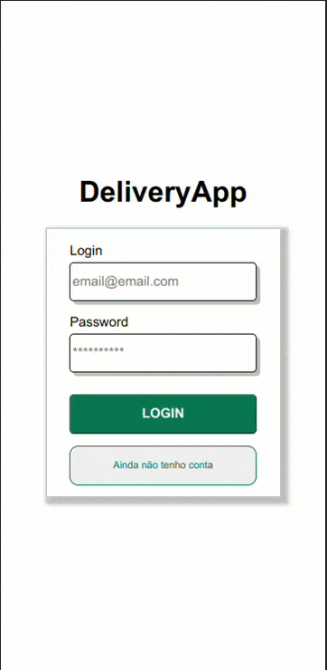
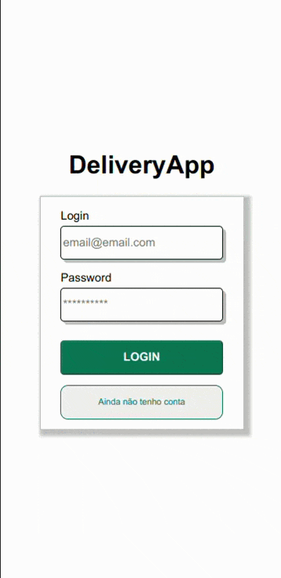

# DeliveryApp

In this project, a delivery app was developed for a beverage distributor. Created for three types of users: Administrator, seller and customer.

The Customer places orders for the sellers, containing a menu, a checkout page, a detailed order page where the order status is tracked and an order page with all the orders already placed by the customer and their status.

The Seller receives the order where he tracks the orders he has received on his order page and updates the status of the orders according to the progress of production.

Administrator can create new users and delete users.

Authentication via jsonwebtoken and password encryption using md5 were developed.


## Stacks

**Front-end:** React, CSS, HTML, JS.

**Back-end:** Node, Express, MySql, Sequelize, Chai, Mocha and Sinon.


## Features

- Order creation
- Persistent shopping cart
- Authentication with JsonWebToken
- Responsive CSS
- Integration tests on the backend
- Docker Compose

## Rodando localmente

Clone

```bash
  git clone git@github.com:luizlacerdam/trybe-delivery-app.git
```

Start a docker container

```bash
  docker container run --name container-mysql -e MYSQL_ROOT_PASSWORD=password -d -p 3002:3306 mysql:8.0.29
```

Go to the repo

```bash
  cd tryber-delivery-app
```

Install dependnecies

```bash
  npm install
```

Go to the front-end

```bash
  cd front-end
```

Install

```bash
  npm install
```

Go to the back end

```bash
  cd ../back-end
```

Install

```bash
  npm install
```

Migre and seed all

```bash
  npm run db:reset
```

Start back-end

```bash
  npm run dev
```

Start front-end

```bash
  cd ../front-end
```

```bash
  npm start
```

## Demo

### Logins and passwords

Customer `zebirita@email.com` and `$#zebirita#$`;

Seller `fulana@deliveryapp.com` and `fulana@123`;

Admin `adm@deliveryapp.com` and `--adm2@21!!--`;

### Customer and seller


### Admins


## Running tests

```bash
  npm run test
```

